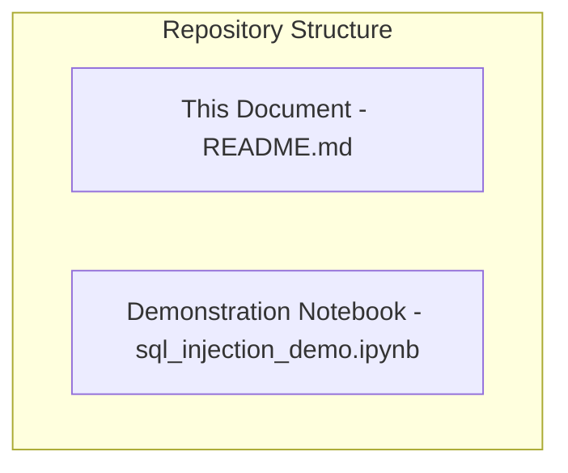
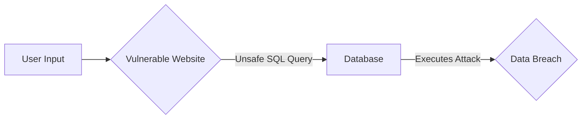
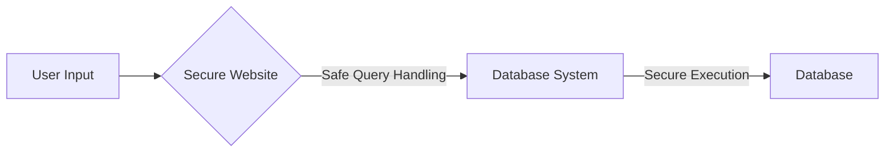

# SQL Injection: A Practical Guide

## About this Repository

This repository offers a practical introduction to SQL Injection. It includes explanations of the concept, its risks, and methods for prevention, along with a hands-on demonstration.

## No installation needed

You can understand the basics of SQL Injection by reading this document.

[Then run the demonstration notebook directly in your browser by clicking this link](https://mybinder.org/v2/gh/kanad13/sql_injection_demo/HEAD).

**This eliminates the need for local setup.**

## Repository Contents

- **Conceptual Overview (This Document):** Explains SQL Injection, its dangers, and how to prevent it.
- **Demonstration Notebook (sql_injection_demo.ipynb):** Provides a runnable example showing SQL Injection vulnerabilities and prevention techniques.

## Understanding SQL Injection

### What is SQL?

- **Database:** Stores website data (users, products).
- **SQL:** Language to manage database data.

### How Websites Use Databases

- Websites use SQL based on user input for actions like login and search.

### The Danger of SQL Injection

**Vulnerable Example:**

- The [demo](./sql_injection_demo.ipynb) shows a login form where user input is directly used in SQL. This is a security risk.

## SQL Injection Explained

- **Injection:** Adding harmful code to inputs.
- **SQL Injection:** Adding SQL commands to input fields to change database actions.
- Occurs when software doesn't properly handle database interactions.

### How Attackers Exploit This

- **SQL Injection Steps:**
  1. Attacker types SQL code into a website form.
  2. Website incorrectly includes this code in its database request.
  3. Database runs the attacker's code.
- **Results:**
  - Unauthorized access.
  - Stolen data.
  - Changed data.
  - Server takeover.

### Preventing SQL Injection

- The demo shows how to prevent this.
- Secure websites use safe query methods.

- **Key Prevention Methods:**
  - **Input Validation:** Checking and cleaning user input to remove harmful parts.
  - **Parameterized Queries:** Using placeholders in SQL and providing user input separately.
  - **Least Privilege:** Giving database users only necessary permissions.

## Explore the Demo

- See the [demo file](./sql_injection_demo.ipynb) for a hands-on look at SQL injection and how to stop it.

## Key Takeaways - SQL Injection

- SQL helps websites use databases.
- SQL Injection happens when bad SQL code gets into website inputs.
- This can cause security problems and data loss.
- Checking inputs and using safe queries are important for prevention.
